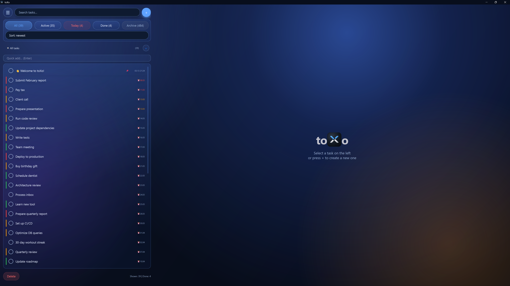
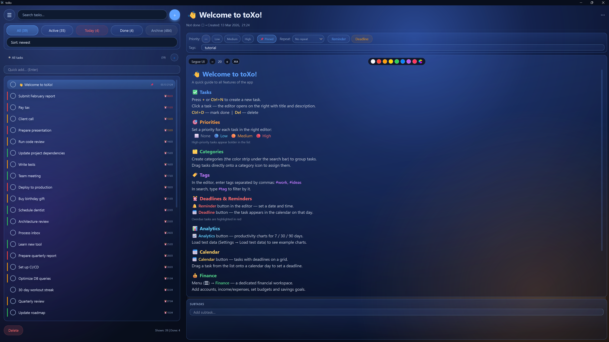
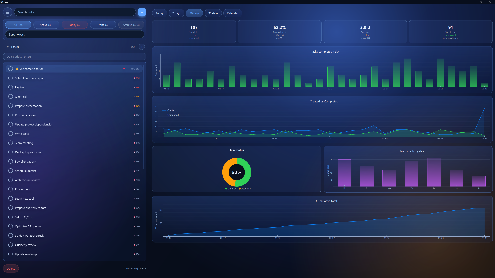
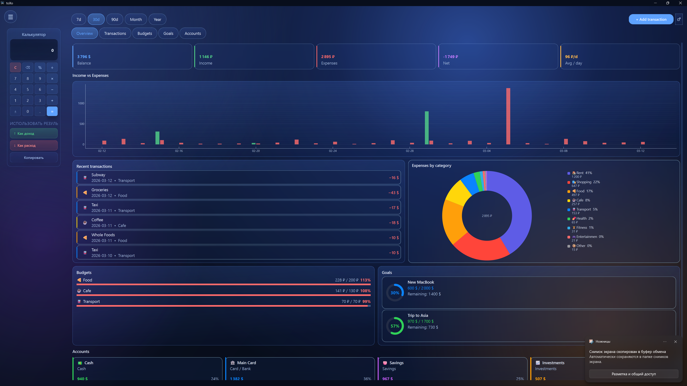
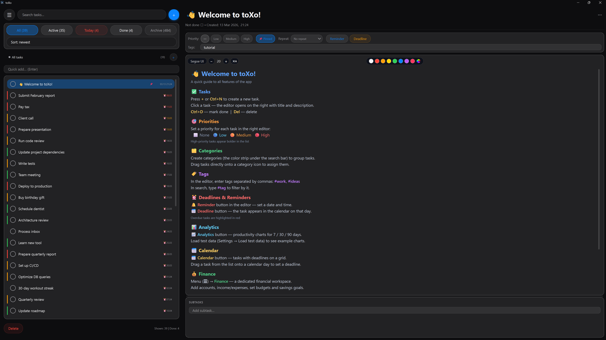

<div align="center">
  
  <br/>
  <p>A desktop productivity app built with PyQt6 — task management, personal finance, analytics, and calendar in one place.</p>
</div>

---

## Overview

**toXo** is a native Windows desktop application written in Python with PyQt6. It combines a full-featured task manager with a personal finance workspace, analytics dashboard, and calendar — all wrapped in a polished UI with three switchable themes.

The database is stored locally in `%APPDATA%/todo_app/tasks.sqlite`. No account, no sync, no internet required.

---

## Features

### Tasks
- Create, edit, and delete tasks with title, description, priority, and tags
- Subtasks, deadlines, reminders, and recurring tasks (daily / weekly / monthly)
- Category system with custom colors — drag tasks onto categories to assign
- Pin tasks to top, bulk-select and bulk-edit, drag-and-drop manual sort
- Auto-archive completed tasks after N days (configurable)
- Undo / redo for task edits and deletions (Ctrl+Z / Ctrl+Y)
- Import and export via CSV or JSON

### Finance
- Accounts with multi-currency support (₽ $ € £ ¥)
- Income and expense transactions with categories
- Monthly budgets per category with progress tracking
- Savings goals with target amount and deadline
- Overview dashboard: KPI cards, income vs expenses chart, category donut, balance trend

### Analytics
- Charts built with pyqtgraph: task completion over time, category breakdown, productivity heatmap
- Filterable by period

### Calendar
- Monthly grid view of tasks by deadline
- Drag tasks from the list directly onto a day to set or move the deadline

### UI / UX
- **Three themes:** Dark (iOS-style), Light, Glass (frosted blur effect with layered transparency)
- Windows 11 native title bar color integration via DWM API
- Command palette (Ctrl+K) — search and trigger any action from the keyboard
- System tray with quick-add and background running
- Russian / English interface, switchable at runtime

---

## Screenshots

**Tasks** — task list with categories, priorities, and tags



**Task editor** — edit title, description, subtasks, deadline, and reminders



**Analytics** — completion charts, category breakdown, productivity heatmap



**Finance** — accounts, transactions, budgets, and savings goals



**Glass theme** — frosted transparency with layered blur effect



---

## Tech Stack

| Layer | Technology |
|-------|-----------|
| UI framework | PyQt6 |
| Charts | pyqtgraph + numpy |
| Database | SQLite (via stdlib `sqlite3`) |
| Architecture | Feature Slice Design (FSD) |
| Platform | Windows (tested on Windows 11) |

---

## Architecture

The project follows [Feature Slice Design](https://feature-sliced.design/) — code is organized by domain and responsibility, not by technical layer.

```
toXo/
├── app/              # Bootstrap, themes, navigation
├── entities/         # Domain models, repositories, services
│   ├── task/
│   ├── category/
│   ├── finance/
│   └── analytics/
├── features/         # UI slices for each user action
│   ├── task/         # filter, edit, manage, undo/redo
│   ├── finance/
│   ├── settings/
│   └── navigation/
├── pages/            # Full-page views (analytics, calendar, finance)
├── widgets/          # Reusable compound widgets (topbar, command palette, etc.)
├── shared/           # DB connection, i18n, config, base UI components
├── tests/            # Unit tests
└── main.py           # Entry point
```

---

## Getting Started

### Requirements

- Python 3.11+
- Windows (Linux/macOS untested)

### Install & Run

```bash
git clone https://github.com/TheOverforge/toXo.git
cd toxo
python -m venv .venv
.venv\Scripts\activate
pip install -r requirements.txt
python main.py
```

---

## Keyboard Shortcuts

| Shortcut | Action |
|----------|--------|
| `Ctrl+K` | Command palette |
| `Ctrl+N` | New task |
| `Ctrl+D` | Toggle done |
| `Ctrl+Shift+D` | Duplicate task |
| `Ctrl+Z` | Undo |
| `Ctrl+Y` | Redo |
| `Ctrl+Up / Down` | Navigate task list |
| `Ctrl+F` | Focus search |

---

## Documentation

Full technical documentation (architecture, DB schema, module breakdown) is available in [`docs/documentation.pdf`](docs/documentation.pdf).

---

## License

MIT
