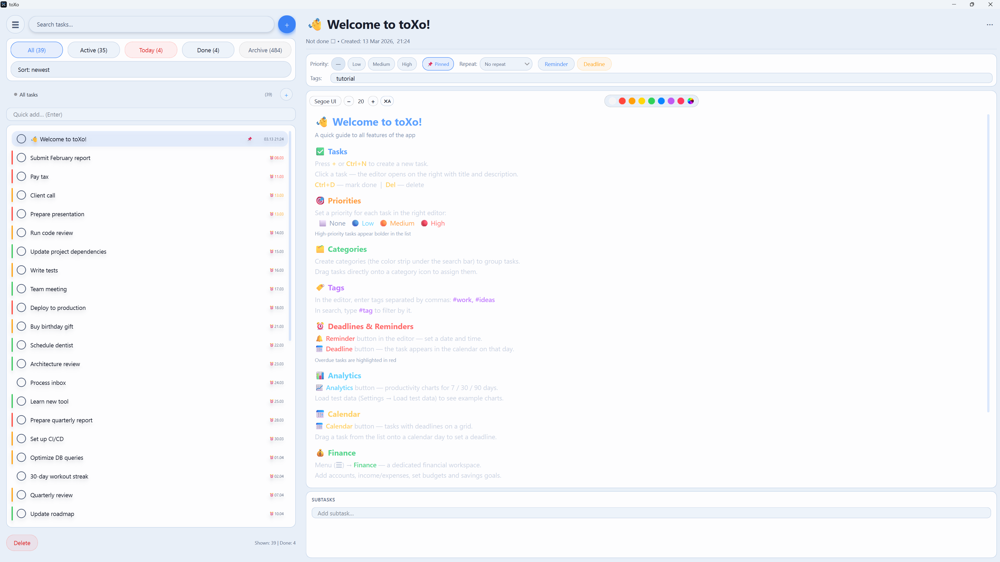

<div align="center">
  

  # toXo

  <p>
    <strong>Task. Finance. Analytics. Calendar.</strong><br/>
    A desktop productivity application built with <strong>PyQt6</strong> — structured, local-first, and designed for focused daily use.
  </p>

  <p>
    
    
    
    
    
  </p>

  <p>
    <a href="https://github.com/TheOverforge">
      
    </a>
  </p>
</div>

---

## Overview

**toXo** is a native Windows desktop application written in **Python + PyQt6**.  
It combines a full-featured **task manager**, **personal finance workspace**, **analytics dashboard**, and **calendar** in one polished interface with three switchable themes.

The project is designed around a simple idea:

> **One local desktop workspace for planning, tracking, and reviewing your work and personal flow.**

No account. No cloud dependency. No forced sync.  
The database is stored locally in:

```text
%APPDATA%/todo_app/tasks.sqlite
```

---

## Why toXo

- **Local-first** — your data stays on your machine
- **Structured UI** — tasks, money, analytics, and planning in one consistent workflow
- **Keyboard-friendly** — command palette, shortcuts, bulk actions, undo/redo
- **Visually polished** — desktop-native feel, theming, custom widgets, DWM integration
- **Built for real usage** — not a demo toy, but a serious personal productivity tool

---

## Features

### Tasks
- Create, edit, and delete tasks with title, description, priority, and tags
- Subtasks, deadlines, reminders, and recurring tasks *(daily / weekly / monthly)*
- Category system with custom colors — drag tasks onto categories to assign
- Pin tasks to the top, bulk-select and bulk-edit, drag-and-drop manual sorting
- Auto-archive completed tasks after **N** days *(configurable)*
- Undo / redo for edits and deletions (`Ctrl+Z` / `Ctrl+Y`)
- Import and export via **CSV** or **JSON**

### Finance
- Accounts with multi-currency support: `₽ $ € £ ¥`
- Income and expense transactions with categories
- Monthly budgets per category with progress tracking
- Savings goals with target amount and deadline
- Overview dashboard with:
  - KPI cards
  - income vs expenses chart
  - category donut
  - balance trend

### Analytics
- Charts built with **pyqtgraph**
- Completion trends over time
- Category breakdown
- Productivity heatmap
- Period-based filtering

### Calendar
- Monthly grid view of tasks by deadline
- Drag tasks from the list directly onto a day to set or move the deadline

### UI / UX
- **Three themes**
  - Dark *(iOS-inspired)*
  - Light
  - Glass *(frosted blur + layered transparency)*
- Windows 11 native title bar color integration via **DWM API**
- Command palette (`Ctrl+K`) — search and trigger actions from the keyboard
- System tray support with quick-add and background running
- Russian / English interface, switchable at runtime

---

## Screenshots

### Tasks
Task list with categories, priorities, and tags *(Glass theme)*


### Task Editor
Edit title, description, subtasks, deadline, and reminders


### Analytics
Completion charts, category breakdown, and productivity heatmap


### Finance
Accounts, transactions, budgets, and savings goals


### Dark Theme
Clean dark UI with iOS-style inspiration


### Light Theme
Minimal light UI



---

## Tech Stack

| Layer | Technology |
|------|------------|
| Language | Python 3.12 |
| UI Framework | PyQt6 |
| Charts | pyqtgraph + numpy |
| Database | SQLite *(via stdlib `sqlite3`)* |
| Architecture | Feature Slice Design *(FSD)* |
| Platform | Windows *(tested on Windows 11)* |

---

## Project Structure

The project follows **Feature Slice Design** — code is organized by domain and responsibility rather than by raw technical layers.

```text
toXo/
├── app/              # Bootstrap, themes, navigation
├── entities/         # Domain models, repositories, services
│   ├── task/
│   ├── category/
│   ├── finance/
│   └── analytics/
├── features/         # UI slices for user actions
│   ├── task/         # filter, edit, manage, undo/redo
│   ├── finance/
│   ├── settings/
│   └── navigation/
├── pages/            # Full-page views (analytics, calendar, finance)
├── widgets/          # Reusable compound widgets
├── shared/           # DB, i18n, config, base UI components
├── tests/            # Unit and integration tests
└── main.py           # Entry point
```

---

## Getting Started

### Requirements

- Python **3.11+**
- Windows  
  *(Linux/macOS are currently untested)*

### Install and Run

```bash
git clone https://github.com/TheOverforge/toXo.git
cd toXo
python -m venv .venv
.venv\Scripts\activate
pip install -r requirements.txt
python main.py
```

---

## Keyboard Shortcuts

| Shortcut | Action |
|----------|--------|
| `Ctrl+K` | Command palette |
| `Ctrl+N` | New task |
| `Ctrl+D` | Toggle done |
| `Ctrl+Shift+D` | Duplicate task |
| `Ctrl+Z` | Undo |
| `Ctrl+Y` | Redo |
| `Ctrl+Up / Down` | Navigate task list |
| `Ctrl+F` | Focus search |

---

## Documentation

Full technical documentation is available here:

```text
docs/documentation.pdf
```

It includes:
- architecture overview
- database schema
- module breakdown
- service layer description
- custom widgets
- themes and settings
- known limitations

---

## Philosophy

toXo is not built around cloud-first hype or unnecessary complexity.

It is built around:
- **clarity**
- **control**
- **local ownership**
- **practical everyday use**

A focused desktop tool should feel fast, intentional, and reliable.

---

## Author

**TheOverforge**  
GitHub: [github.com/TheOverforge](https://github.com/TheOverforge)

---

## License

This project is licensed under the **MIT License**.
